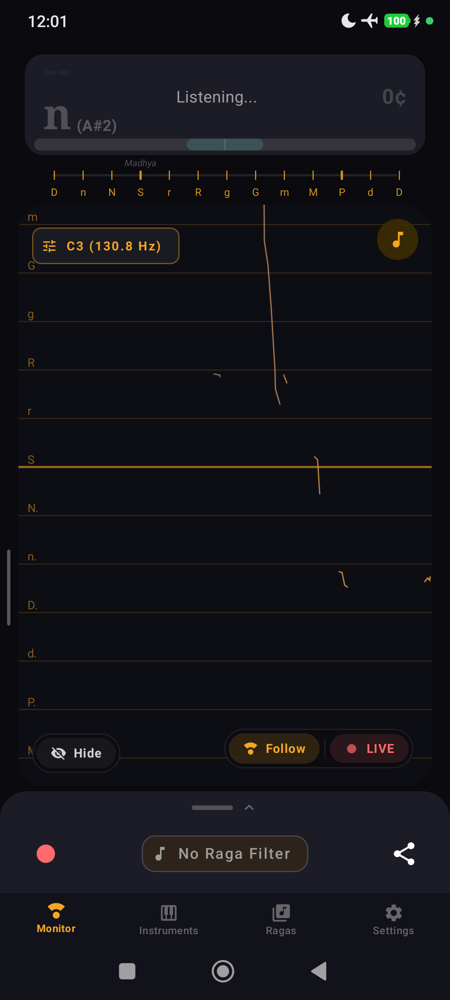
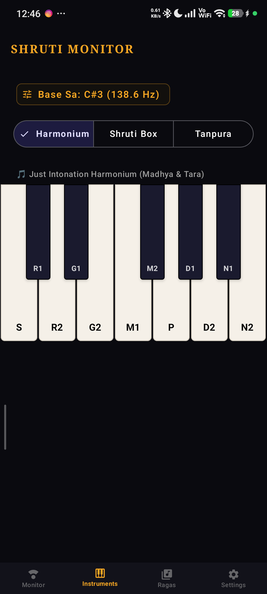
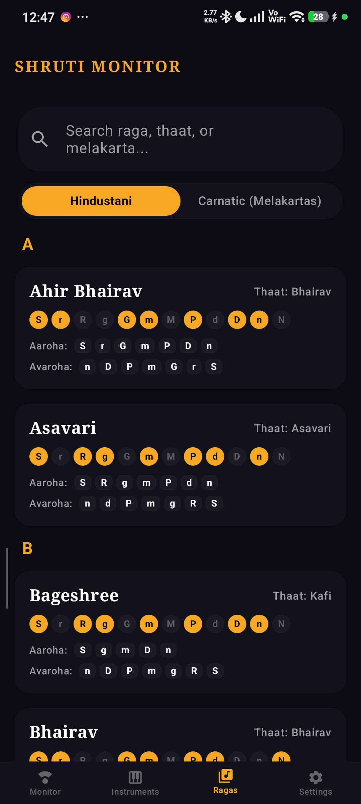
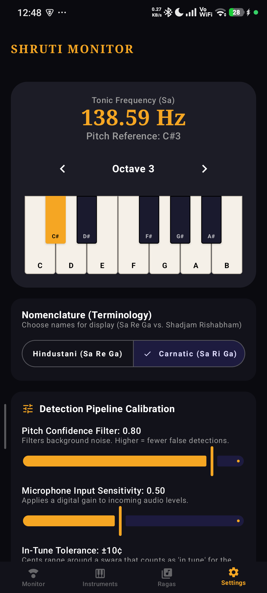
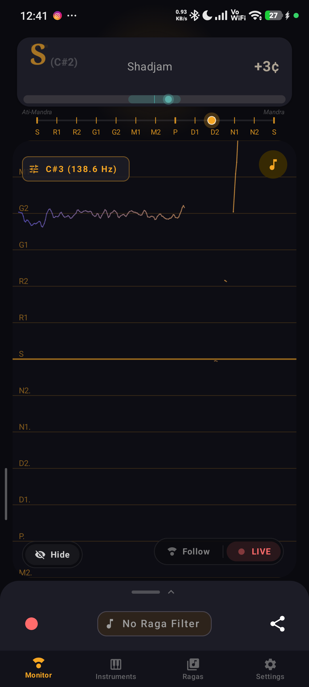
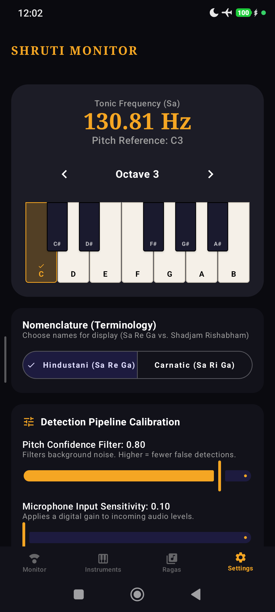

# 📜 Shruti Monitor Changelog

All notable changes to the **Shruti Monitor** application are documented in this file.

---

## [Version 1.2.0] - 2026-09-08

### 🌟 Release Summary
Version 1.2.0 introduces multi-system mathematical tuning presets (Harmonic 5-Limit Just Intonation, Pythagorean 3-Limit Just Intonation, and 12-Tone Equal Temperament), decoupling nomenclature from the tuning engine with intelligent tradition defaults. It also adds a native in-app software update checker and one-click package installer.

---

### 🚀 Key Improvements & New Features

#### 1. 🎼 Multi-System Mathematical Tuning Engine
- **Harmonic (5-Limit JI)**:
  - Uses pure harmonic thirds and fifths ($G_2 = 6/5$, $D_1 = 8/5$, $N_2 = 9/5$).
  - Produces $G_2$ at $315.64\text{¢}$, eliminating acoustic beating against the Tanpura drone; ideal for Hindustani music, bansuri, and vocal riyaz.
- **Pythagorean (3-Limit JI)**:
  - Derived via the cycle of continuous fourths and fifths ($G_2 = 32/27$, $D_1 = 128/81$, $N_2 = 16/9$).
  - Produces $G_2$ at $294.13\text{¢}$, exactly $21.51\text{¢}$ (Pramāna Shruti / Syntonic Comma) flatter than 5-limit intervals.
  - Aligns with traditional Carnatic Veena swarasthana charts and classical treatises (*Venkatamakhin's Chaturdandi Prakasika*, Sambamoorthy).
- **12-Tone Equal Temperament (12-EDO / Western)**:
  - Standard chromatic reference with equal 100¢ semitones ($G_2 = 300.0\text{¢}$) for practicing alongside keyboards, pianos, and Western tempered instruments.
- **Real-Time Visual Grid Remapping**:
  - Horizontal pitch canvas gridlines dynamically interpolate and align with the active tuning system in real time.
- **Floating Quick-Switch Chip**:
  - Direct one-tap cycling chip on the Pitch Monitor screen allows musicians to toggle tuning presets instantly during performance or riyaz.

#### 2. 🎛️ Decoupled Nomenclature & Intelligent Defaults
- **Separate Nomenclature & Tuning Controls**:
  - The swara naming convention (`Hindustani [Sa Re Ga]` vs. `Carnatic [Sa Ri Ga]`) is completely decoupled from the acoustic tuning engine.
- **Smart Tradition Defaults**:
  - Selecting Carnatic nomenclature defaults to **Pythagorean (3-Limit JI)**.
  - Selecting Hindustani nomenclature defaults to **Harmonic (5-Limit JI)**.
  - If a musician explicitly chooses a tuning preset, their preference is locked and preserved across tradition and raga switches.

#### 3. 🔄 Native In-App Software Updates & One-Click Installer
- **Background Checks**: Automatically checks GitHub Releases on launch (throttled to once every 24 hours).
- **Update Dialog**: Presents release notes / changelog, download size, and real-time streaming download progress bar.
- **One-Click Installation**: Downloads to application cache and triggers native Android package installation via secure `FileProvider`.
- **Manual Check**: Added a dedicated "Software Updates" row with status indicator in Settings -> About.

---

## [Version 1.1.1] - 2026-09-08

### 🌟 Release Summary
Version 1.1.1 resolves a critical state preservation and navigation issue where the Tanpura drone playback state was lost when navigating across tabs, and ensures bottom tab navigation cleanly restores screen state.

---

### 🚀 Bug Fixes & Improvements

#### 1. 🪕 Tanpura Playback State Synchronization Across Navigation
- **Root-Cause Fix**: `PlayViewModel` previously defaulted `tanpuraPlaying` to `false` and lacked reactive observation of the background `TanpuraSynthesizer` sequencer thread.
- **Live State Flow**: `TanpuraSynthesizer` now provides an observable `isPlaying: StateFlow<Boolean>` that stays synchronized with the physical synthesis thread. `PlayViewModel` subscribes to this state and initializes directly from the synthesizer's live state.
- **Reliable Toggle**: Tapping the Tanpura button directly checks the engine's physical running status instead of inverting a local flag, eliminating desynchronized button states.
- **Uninterrupted Riyaz**: Removed synthesizer teardown on screen disposal so the Tanpura drone continues playing continuously in the background while musicians practice and monitor pitch on the Monitor tab.
- **App Lifecycle Cleanup**: Added `onDestroy()` in `MainActivity` to release audio synthesizer resources when the app is completely exited.

#### 2. 🧭 Bottom Tab Navigation Backstack Restoration
- **Root-Cause Fix**: Bottom navigation tab clicks previously targeted the already-popped splash screen route for `popUpTo`, causing navigation to fail to pop destinations and continuously inflate the backstack with duplicate screens on every tab switch.
- **Proper State Preservation**: All tab navigation and Ragas navigation now pop up to `Screen.Monitor.route` with `saveState = true` and `restoreState = true`, cleanly preserving tab state, scroll positions, and instrument selections.

---

## [Version 1.1.0] - 2026-09-06

### 🌟 Release Summary
Version 1.1.0 is a landmark audio and graphics engine overhaul for Shruti Monitor. It completely transforms the real-time pitch tracking experience, delivering fluid, continuous vocal pitch contours matching professional reference monitors while preserving Indian classical music nuances (*meend*, *gamakas*, microtonal *shrutis*).

---

### 📸 Release Screenshots

  
  
  

  
  
  

---

### 🚀 Key Improvements & New Features

#### 1. 🎙️ Continuous, Fluid Vocal Pitch Curve
- **Root-Cause Fix**: Eliminated the median filter and exponential moving average (EMA) that previously quantized diagonal vocal glides into artificial vertical/horizontal "staircases".
- **Pure Parabolic Peak Passthrough**: Uses McLeod Pitch Method (MPM) with sub-sample parabolic interpolation, plotting true natural vocal intonation without lag.
- **Hardware-Accelerated Batched Rendering**: Replaced individual path allocations with OpenGL/Vulkan batched `drawLines`, maintaining a locked 60/120 FPS render loop.

#### 2. ⚡ Time-Aware Dynamic Pitch Discontinuity Rule
- **Adaptive Velocity Gating**: In previous builds, static cent jump caps fragmented rapid descending scales and fast *taans*. The new rule calculates maximum allowable pitch delta dynamically based on actual elapsed frame time:
  $$\Delta c_{\text{max}} = \max\left(250\text{¢},\, \min\left(500\text{¢},\, 6000\text{¢/s} \times \Delta t_{\text{actual}}\right)\right)$$
- **Musical Coherence**: Preserves intentional musical transitions and rapid pitch bends (*gamakas*) as continuous lines while cleanly breaking across genuine octave leaps or musical pauses.

#### 3. 🛡️ Dual-Threshold Voicing Hysteresis (Schmitt Trigger)
- **Attack Threshold (`0.82`)**: Requires high confidence to enter voicing, completely rejecting room fan rumble, breath intakes, and ambient Tanpura acoustic bleed during silence.
- **Sustain/Decay Threshold (`0.70`)**: Once voiced, the required threshold drops by $0.12$ to follow soft vocal endings, delicate *nyasa* notes, and quiet low chest resonance (*Mandra Saptak*) without premature dropouts.

#### 4. 🌉 Micro-Gap Visual Bridging
- Detects transient single-frame detector dropouts ($\le 80\text{ ms}$) caused by acoustic cancellation or room reflections.
- Visually bridges micro-gaps to maintain continuous visual traces during sustained singing, while strictly respecting genuine musical silence ($> 80\text{ ms}$).

#### 5. ⏱️ Hardware Audio Capture Timestamps
- Audio capture timestamps from Android's `AudioRecord` hardware buffer are now stamped at ingestion and carried directly to the canvas coordinate mapping (`timeMs - minTimeMs`).
- Eliminates horizontal frame jitter caused by Android OS thread scheduling and variable garbage-collection pauses.

#### 6. 👆 1-Finger Vertical Pan & Viewport Navigation
- When **Auto-Follow** is disabled, musicians can freely touch and drag the pitch canvas up or down with one finger to inspect any octave (*Ati-Mandra* to *Taar Saptak*).
- Added smooth drag velocity handling without interfering with horizontal timeline tracking.

#### 7. 🎯 Accurate Swara Cent Tuning Display
- Fixed cent deviation readout in the top Swara Card to show the exact microtonal deviation from the current active Just Intonation swara instead of cumulative cents from Sa.
- Instant color-coded feedback (Mint Green for in-tune, Amber/Red for off-pitch) with configurable in-tune tolerance ($\pm 5\text{¢}$ to $\pm 25\text{¢}$).

#### 8. 📊 In-Memory Telemetry & Diagnostics
- Added a lightweight, circular diagnostic telemetry buffer (`PitchPipelineTelemetry`) capturing sample timestamps, raw frequencies, confidence scores, and RMS energy for ongoing acoustic performance validation.

---

## [Version 1.0.0] - 2026-09-04

### Initial Public Release
- **Real-Time Pitch Detector**: McLeod Pitch Method (MPM) 50 Hz – 2000 Hz real-time audio capture.
- **Microtonal Just Intonation Engine**: 22-Shruti scale mapping for Hindustani and Carnatic classical systems.
- **High-Fidelity Tanpura Drone**: Sample-based 4-string acoustic sequencer with tempo, fine-tuning (±50¢), and A4=432Hz switch.
- **Just Intonation Harmonium**: Interactive touch keyboard supporting Madhya and Tara saptaks.
- **Comprehensive Raga Explorer**: 100+ Hindustani and Carnatic ragas with scale structures, vadi, samvadi, and aaroha/avaroha.
- **Session Recorder**: High-quality practice recording with direct system share sheet integration.
